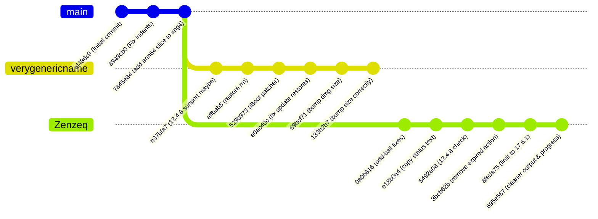

# Repository Comparison & Diff Analysis: Zenzeq vs verygenericname

This document provides a comprehensive comparison between the two Apple TV 4K IPSW creation repositories:
- **`Zenzeq-TV4K_IPSW_Script`** (Fork by Zenzeq)
- **`verygenericname-TV4K_IPSW_Script`** (Upstream by verygenericname)

---

## 1. Executive Summary

Both repositories provide a bash script (`makeipsw.sh`) and helper binaries (`Darwin/`) to construct a restore IPSW for the Apple TV 4K (AppleTV6,2 / `j105a`) using an OTA update zip and an Apple TV HD (AppleTV5,3) restore IPSW.

### Key Takeaways
1. **Divergence Point**: Both repositories share common history up to commit `7845e84` (*"add arm64 slice to img4"*).
2. **User Experience / Terminal Output**:
   - **`Zenzeq`** heavily overhauled the terminal UX in `makeipsw.sh`: added a graphical percentage progress bar (`progress()`), suppressed raw verbose output from tools like `unzip`, `aa`, `rsync`, `diskutil`, `hdiutil`, and `asr`, replacing them with clean single-line carriage-return status lines (`\rCurrently: ...`).
   - **`verygenericname`** retains standard verbose terminal output with no progress bar.
3. **Compatibility & Behavioral Regressions**:
   - **`verygenericname`** extracts `major_version` early and dynamically chooses `EXTRACT_TOOL` (`Darwin/yaa` for tvOS < 14, `/usr/bin/aa` for tvOS >= 14). In ramdisk patching, it only runs `restored_external64_patcher` if `major_version >= 15`.
   - **`Zenzeq`** moved version extraction to the end of the script and removed the `major_version >= 15` guard, causing `restored_external64_patcher` to always run, which breaks on tvOS < 15.
   - **`Zenzeq`** added a SHA-256 check to reject tvOS 13.4.8 at the top of the script, but running `shasum -a 256 $1` before downloading fails if `$1` is a remote URL.
   - **`verygenericname`** introduced commit `e0ac40c` (*"remove checks that broke update restores, oops"*), which cleans up old trustcache files (`rm $(plutil ...)`). **`Zenzeq`** lacks this fix.
4. **Helper Binaries (`Darwin/`)**:
   - **`verygenericname`** includes `KPlooshFinder`, `iBoot64Patcher`, `kerneldiff`, and `yaa`.
   - **`Zenzeq`** pruned these four binaries, retaining only `asr64_patcher`, `img4`, `ldid`, `pzb`, `restored_external64_patcher`, and `trustcache`.

---

## 2. File Inventory & Hash Matrix

| File Path | `verygenericname` SHA-256 | `Zenzeq` SHA-256 | Status | Notes |
| :--- | :--- | :--- | :--- | :--- |
| `.gitignore` | `b084964645...` | `b084964645...` | **MATCH** | Identical |
| `LICENSE` | `432c7ef51a...` | `432c7ef51a...` | **MATCH** | Identical BSD 3-Clause |
| `template.dmg` | `82f931dcb0...` | `82f931dcb0...` | **MATCH** | Identical APFS template (4.2 MB) |
| `Darwin/asr64_patcher` | `7be29aa3d5...` | `7be29aa3d5...` | **MATCH** | Identical binary (67,632 bytes) |
| `Darwin/img4` | `64df6e58f2...` | `64df6e58f2...` | **MATCH** | Identical fat binary (262,008 bytes) |
| `Darwin/ldid` | `cfae60e81a...` | `cfae60e81a...` | **MATCH** | Identical binary (5,422,872 bytes) |
| `Darwin/pzb` | `8b191c95be...` | `8b191c95be...` | **MATCH** | Identical partialzipbrowser (190,208 bytes) |
| `Darwin/restored_external64_patcher` | `84c4897f9d...` | `84c4897f9d...` | **MATCH** | Identical binary (67,760 bytes) |
| `Darwin/trustcache` | `9b3eb16913...` | `9b3eb16913...` | **MATCH** | Identical binary (150,728 bytes) |
| `Darwin/yaa` | `e99f4ffc0e...` | *Missing* | **ONLY in verygenericname** | Required for extracting tvOS < 14 archives |
| `Darwin/KPlooshFinder` | `b18536ec6f...` | *Missing* | **ONLY in verygenericname** | Kernel patch finder utility |
| `Darwin/iBoot64Patcher` | `761f034ef2...` | *Missing* | **ONLY in verygenericname** | iBoot/iBEC patcher utility |
| `Darwin/kerneldiff` | `ca681600f6...` | *Missing* | **ONLY in verygenericname** | Kernel diff utility |
| `README.md` | `6612ed8583...` | `fe03900aa8...` | **DIFF** | verygenericname references futurerestore actions URL |
| `makeipsw.sh` | `68916f695a...` | `187e950c50...` | **DIFF** | See detailed code diff below |

---

## 3. Git Divergence & Commit History

Both repositories share root commit `af486c9` through divergence point `7845e84`.



### Upstream (`verygenericname`) Commits since Divergence:
1. `b37bfa7`: Added `KPlooshFinder`, `kerneldiff`, `yaa`. Added `major_version < 14` detection to use `yaa` instead of `/usr/bin/aa`.
2. `affbab5`: Corrected `rm` invocations.
3. `529b973`: Added `Darwin/iBoot64Patcher` and experimental commented-out iBoot/iBEC patching.
4. `e0ac40c`: Removed `if [ -e ... ]` check and explicitly removed existing `RestoreTrustCache` paths via `plutil -extract ...` before assigning the new trustcache. This resolved failed update restores.
5. `69bcf71` & `133b2b7`: Bumped root DMG resize from `10000m` to `15000m` for tvOS 18/26 support.

### Fork (`Zenzeq`) Commits since Divergence:
1. `0a0b816`: Fixed odd-ball issues.
2. `e18b0a4`: Added progress/status notifications during long file copy operations.
3. `5492e08`: Added SHA-256 block check for tvOS 13.4.8.
4. `3bcb62b`: Removed expired GitHub Actions link for futurerestore from `README.md`.
5. `8feda75`: Updated incompatibility message to specify tvOS 14 - 17.6.1.
6. `695e567`: Major UX rewrite:
   - Added ASCII percentage progress bar `progress()`.
   - Piped `unzip`, `aa extract`, `hdiutil`, `diskutil`, and `asr` outputs to `\rCurrently: ...`.
   - Converted bulk `cp -a ../payload/replace/* .` to a file-by-file loop calculating percentage progress.
   - Pruned unused `Darwin/` tools (`KPlooshFinder`, `iBoot64Patcher`, `kerneldiff`, `yaa`).

---

## 4. Deep Dive: `makeipsw.sh` Code Comparison

### 4.1. Progress Bar & Terminal UX
- **`Zenzeq`**:
  Defines a 50-character ASCII progress bar:
  ```bash
  progress() {
      local current=$1
      local total=$2
      local percent=$((100 * current / total))
      local filled=$((percent / 2))
      local empty=$((50 - filled))
      printf "\r["
      for ((i=0; i<filled; i++)); do printf "#"; done
      for ((i=0; i<empty; i++)); do printf "-"; done
      printf "] %3d%%" "$percent"
  }
  ```
  Applies it to unzipping, payload extraction, copying files from `payload/replace`, DMG resizing, volume renaming, conversion, and scanning.
- **`verygenericname`**:
  Runs raw commands with standard output (`set -e` enabled). Output can be verbose and noisy.

### 4.2. tvOS 13.4.8 Hash Check & Remote URL Bug
- **`Zenzeq`** (Lines 32-42):
  ```bash
  sum=$(shasum -a 256 $1 | cut -d' ' -f1)
  if [ $sum = "8725797b4ddfd93fc67023c93c1d9277f128e9731a9ac18618b9b2e812c027c1" ] ; then
      echo "13.4.8 detected. The script is incompatible for this version. Please use firmwares between tvOS 14 - 17.6.1." && exit 1
  else
      echo "Unzipping..."
  fi
  ```
  **Issue**: If `$1` is an HTTP(S) URL (which the script explicitly supports via `wget`), `shasum -a 256 $1` attempts to read a non-existent local file named like the URL, resulting in an error before `wget` ever runs.
- **Fix**: Run `shasum` only after confirming `$1` is a local file, or perform the check after `wget` downloads the file into `downloads/`.

### 4.3. Version Detection & Extraction Tool (`EXTRACT_TOOL`)
- **`verygenericname`** (Lines 34-41):
  ```bash
  ipsw_buildnumber=$(plutil -extract "ProductBuildVersion" raw -expect string -o - AssetData/boot/BuildManifest.plist)
  ipsw_version=$(plutil -extract "ProductVersion" raw -expect string -o - AssetData/boot/BuildManifest.plist)
  major_version=$(echo "$ipsw_version" | grep -oE '^[0-9]+' )
  if [ "$major_version" -lt 14 ]; then
      EXTRACT_TOOL="$(cd ../../Darwin && pwd)/yaa"
  else
      EXTRACT_TOOL=/usr/bin/aa
  fi
  ```
- **`Zenzeq`**:
  Removed this block and moved `ipsw_buildnumber` and `ipsw_version` to lines 327-328 at the very end of the script. Hardcoded `sudo aa extract -i ...`.
  **Issue**: Omitting `major_version` breaks the subsequent conditional ramdisk patcher logic.

### 4.4. Ramdisk Patching & `restored_external64_patcher`
- **`verygenericname`** (Lines 152-160):
  ```bash
  if [ "$major_version" -ge 15 ]; then
      sudo ../../Darwin/restored_external64_patcher "$restoreramdisk_mount_path"/usr/local/bin/restored${restored_suffix}{,.patched}
      sudo mv "$restoreramdisk_mount_path"/usr/local/bin/restored${restored_suffix}{.patched,}
      sudo ../../Darwin/ldid -s "$restoreramdisk_mount_path"/usr/local/bin/restored${restored_suffix} "$restoreramdisk_mount_path"/usr/sbin/asr
      sudo chmod 755 "$restoreramdisk_mount_path"/usr/local/bin/restored${restored_suffix} "$restoreramdisk_mount_path"/usr/sbin/asr
  else
      sudo ../../Darwin/ldid -s "$restoreramdisk_mount_path"/usr/sbin/asr
      sudo chmod 755 "$restoreramdisk_mount_path"/usr/sbin/asr
  fi
  ```
- **`Zenzeq`** (Lines 309-313):
  Unconditionally executes `restored_external64_patcher` on every version:
  ```bash
  sudo ../../Darwin/restored_external64_patcher "$restoreramdisk_mount_path"/usr/local/bin/restored${restored_suffix}{,.patched}
  sudo mv "$restoreramdisk_mount_path"/usr/local/bin/restored${restored_suffix}{.patched,}
  sudo ../../Darwin/ldid -s "$restoreramdisk_mount_path"/usr/local/bin/restored${restored_suffix} "$restoreramdisk_mount_path"/usr/sbin/asr
  sudo chmod 755 "$restoreramdisk_mount_path"/usr/local/bin/restored${restored_suffix} "$restoreramdisk_mount_path"/usr/sbin/asr
  ```
  **Issue**: On tvOS 14 and earlier, `restored_external` does not exist at `/usr/local/bin/restored_external`, causing this step to fail.

### 4.5. TrustCache Removal for Update Restores
- **`verygenericname`** (Lines 87 & 97):
  ```bash
  rm $(plutil -extract "BuildIdentities".0."Manifest"."RestoreTrustCache"."Info"."Path" raw -expect string -o - BuildManifest.plist) | true
  ...
  rm $(plutil -extract "BuildIdentities".1."Manifest"."RestoreTrustCache"."Info"."Path" raw -expect string -o - BuildManifest.plist) | true
  ```
- **`Zenzeq`**:
  Omitted these two lines entirely.
  **Issue**: Upstream found that leaving stale trustcache paths broke update restores (commit `e0ac40c`).

---

## 5. Summary of Recommended Merge Action

A unified script should incorporate:
1. **Zenzeq's `progress()` function and clean status output**.
2. **Safe 13.4.8 SHA-256 detection** that properly handles remote URLs.
3. **Early `major_version` extraction** and `EXTRACT_TOOL` dynamic selection.
4. **Conditional `restored_external64_patcher`** for `major_version >= 15`.
5. **TrustCache cleanup** (`rm $(plutil ...)`) from upstream commit `e0ac40c`.
6. **Retention of `Darwin/` binaries** to preserve backwards compatibility.
